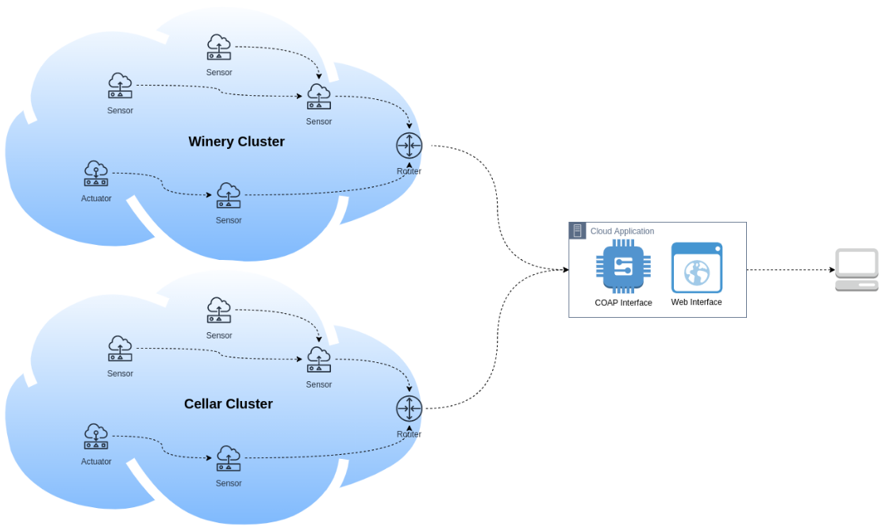

# IoT-Winery
This is my project for the Internet of things course. The application is composed by:
* WSN Clusters of Contiki operated devices
* A webapplication managing the devices
* A simple web interface to let the manager interact with the system

The idea is to create different networks of IoT devices able to collect data on different physical metrics through sensors:
* Temperature
* Light
* Umidity

The aggregated data as well as a set of triggers for actuators can be managed by the user using a Tomcat Webapplication.

 

# Functionalities

Devices register to the cloud application by performing a POST request on the <<devices>> resource exposed by the server specifying its role: "sensor_node" or "border_router"'
After the registration the cloud application creates an observer for every resource that has the "obs" option.
The neighbor list of the border router wil be used to create the clusters.

The Sensors expose one or more CoAP resources (both sensors and actuators) and periodically sends data to the Cloud Application which will update the client in real-time

The Border Routers expose one observable CoAP resource called "cluster_info" containing its neighbor list and periodically sends its neighbor list to the cloud application

The user through the web interface can:
* Select a device (divided by clusters)
* Track sensor values using a graph (updated in real time)
* Set a new value for the actuator